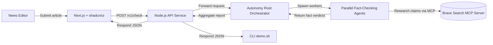

# BIAZ Fact Checker

Autonomous, parallelized real-time fact validation engine powered by Autonomy.

## 🚀 Mission

BIAZ Fact Checker is a **high-speed autonomous truth verification system**.
Given any news article or claim, it:
- **extracts individual facts**
- **spawns thousands of Autonomy AI agents in parallel**
- **scores truthfulness from 0% (likely false) to 100% (likely true)**
- returns **per-fact audit** + **aggregate credibility score**

---

## ✅ Hackathon Scope (MVP)

**Live endpoints (after first deploy):**
- Web UI → https://news.biaz.hurated.com
- API → https://api.news.biaz.hurated.com

**MVP Capabilities (hackathon deliverable):**
- Web UI with textarea → returns extracted facts + confidence score
- API `/v1/check` → JSON output (per-fact + aggregate)
- CLI `demo.sh` → stdin → JSON or human-readable output
- Autonomy **root orchestrator** already handles parallel validation
- Source visibility optional (hidden by default, toggle via env)

**Not required for MVP (stretch / future):**
- Real-time external source retrieval
- Weaviate vector memory / historical contradiction search
- Fine-grained reputation system
- LlamaIndex / FriendliAI integrations

Hackathon goal is **speed + autonomy + correctness scaffold**, not full knowledge web.

---

## Current Progress

- Base repository scaffolding in place: `.gitignore`, `.dockerignore`, `.env.example`, and initial `api/`, `web/`, `scripts/` directories.
- Autonomy `factcheck` zone deployed from `/mnt/fact-checker/autonomy-root`, reachable via the cluster URL.
- Added `scripts/deploy.sh` to automate committing, pushing, syncing `.env`, and running remote `docker compose` rollout.

---

## CLI Toolkit

- `api/bin/demo.sh`
  - Reads stdin article text and POSTs to `http://${host}:${port}/v1/check` (defaults `localhost:21000`).
  - Use `--json` for raw API response, `--host` / `--port` to target remote deployments.
- `scripts/deploy.sh`
  - Automates optional commit (`-m`), `git push`, remote `.env` sync, and `docker compose` rollout.
  - Defaults to remote mode targeting `news.biaz.hurated.com`; add `--local` to run locally when Docker is available.
- `scripts/ports.sh`
  - Prints Docker container port mappings. Defaults to remote host; pass `local` to inspect the current machine.
- `scripts/setup-autonomy.sh`
  - Initializes or redeploys the Autonomy zone (`factcheck` by default) and captures the public agent URL.
  - Optionally updates an env file via `--output-env PATH`.

---

## Networking

- Forward `api.news.biaz.hurated.com` → `localhost:21000` (`API_PORT`).
- Forward `news.biaz.hurated.com` → `localhost:22000` (`WEB_PORT`, reserved for the upcoming web app).

---

## Architecture Diagram



---

## 🏗 Architecture (current MVP)

```
User → Next.js Web → Node.js API → Autonomy Root Agent
                                  ↳ forks 50–500+ child agents
                                   ↳ returns structured fact judgments
```

---

## 📦 Installation

```bash
git clone https://github.com/BIAZ-AI/fact-checker.git
cd fact-checker
cp .env.example .env   # fill AUTONOMY_AGENT_URL + ports
docker compose build && docker compose up -d
```

Test locally via CLI:
```bash
echo "Some text" | api/bin/demo.sh --json
```

Deployment:
```bash
./scripts/deploy.sh -m "initial deploy"
```

---

## 🔭 Future Expansion (Post-Hackathon Roadmap)

✅ = actively prioritized

| Feature | Status |
|---------|--------|
| Real-time reputable source retrieval | ✅ Planned next |
| Weaviate vector memory (historical claims lookup) | ✅ Next step |
| FriendliAI fast inference for low-latency audits | ✅ Optional enhancement |
| LlamaIndex for deeper agentic citation alignment | ✅ High-value |
| Reputation-weighted scoring | ✅ Leads to V1.0 |
| Exportable public audit reports | ✅ Future |
| API keys + billing + public SaaS | ✅ Business layer |

---

## 🤝 Contributions

This repo is hackathon-first, production-second.
Pull requests **should not break demo flow**.
Focus is **incremental working milestones**, not perfection.

---

## 📎 Reference

- GitHub: https://github.com/BIAZ-AI/fact-checker
- UI: https://news.biaz.hurated.com
- API: https://api.news.biaz.hurated.com

See `TODO.md` for execution steps and Autonomy setup instructions.

---

**BIAZ = Bring Intelligence Against Zero-truth**  
Let's make news verifiable again.